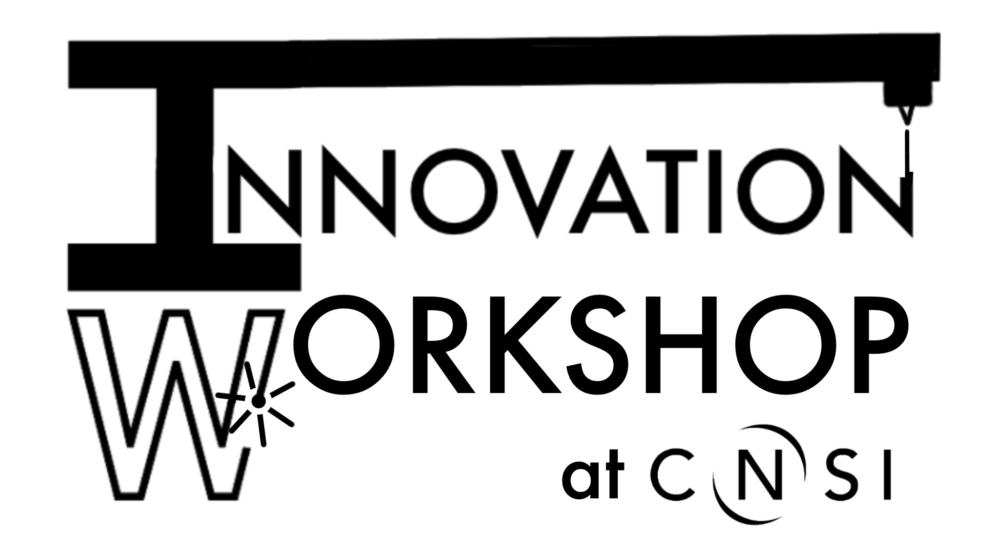

# Welcome to the Innovation Workshop

The CNSI Innovation Workshop includes the **rapid prototyping facility in Elings 3430** and the **Machining Hub in Elings 2442**.

These are shared recharge facilities that have a wide selection of 3D printers (resin and FDM), polymer casting equipment, a 100W laser cutter, and a variety of both CNC and manual machine tools.

Dr. Brian Dincau and the Innovation Workshop staff (Workshop Wizards) can teach you how to use any of our equipment and, perhaps more importantly, help you figure out how to quickly turn an idea into a functional prototype or experiment. We have experience spanning biology, engineering, physics, marine science, art, architecture, and more. See our Projects page for a far-from-comprehensive overview of some of our past collaborations.

The Innovation Workshop is open to all UCSB research groups, student clubs, and industry users.

## Quick Links
* [Job-Submission-Form](https://docs.google.com/forms/d/e/1FAIpQLSeQZ5JnKzOf-UZA0yWZ1XwLGQjmtgyEOFxxHWpZWUUIa8OxcA/viewform)
* [Training-Request-Form](https://docs.google.com/forms/d/e/1FAIpQLSewzNVlJc5TImlY7OTR7UUEUHzaQ3CSZ5R6joGe0HDVbSZMXw/viewform)

## Announcements

7/29/26

We are in the process of migrating from DokuWiki to GitHub. I am hoping to complete this process by the beginning of Fall quarter. If you are a GitHub enthusiast and have any suggestions for me, please share them! I am hoping that, in time, lab users can submit markdown files to me and I can feature their work on this wiki.

## Contact Information

_Lab Manager_  
Brian Dincau: Elings 3205 | bdincau@ucsb.edu | (805) 724-0426

_Workshop Wizards_  
Noelia: noeliaquintanar@ucsb.edu

Remy: remywong@ucsb.edu        (Out for Summer)  
Kenneth: kennethkho@ucsb.edu   (Out for Summer)  
Marcos: marcos150@ucsb.edu     (Out for Summer)  
Ava: agraef@ucsb.edu           (Out for Summer)  

##Feedback
[Innovation Workshop Feedback Form](https://forms.gle/YvvXqV18izy4TumY6)
